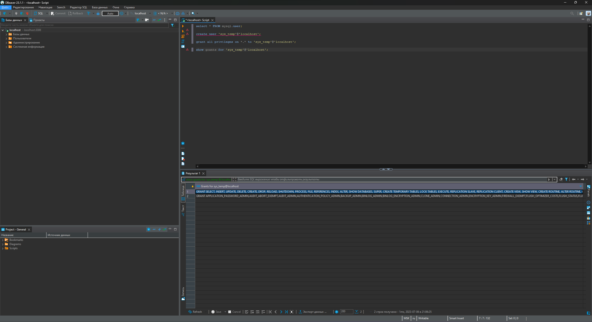

# «Работа с данными (DDL/DML)» | "Бойко Владислав"
---
## Задание 1


По какой то причине не получалось восстановить бд из под бобра, помогла команда в командной строке

При этом почему то опять же не удается получить список баз данных через командную строку(на самой винде поднимал сервер может дело в этом). Вот список всех дб.


Вот портянка команд:
```mysql
CREATE USER 'sys_temp'@'localhost' IDENTIFIED BY '1111';

select * from mysql.user;

GRANT ALL PRIVILEGES ON *.* TO 'sys_temp'@'localhost';

FLUSH privileges;

SHOW GRANTS FOR 'sys_temp'@'localhost';

create database vladdb

show databases
```
ALTER USER 'sys_test'@'localhost' IDENTIFIED WITH mysql_native_password BY '1111'; - это вообще вроде для смены пароля команда, не вышло ни разу через нее поменять пользователя, в итоге f4 и изменение данных в dbeawer 
---
## Задание 2
---